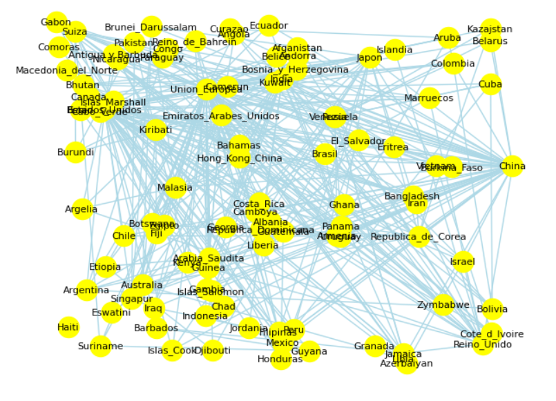
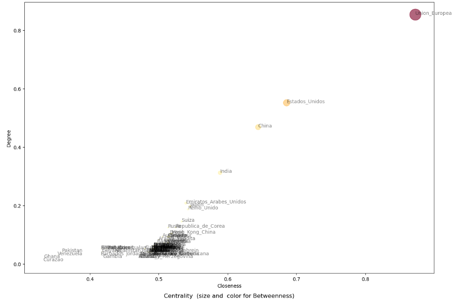
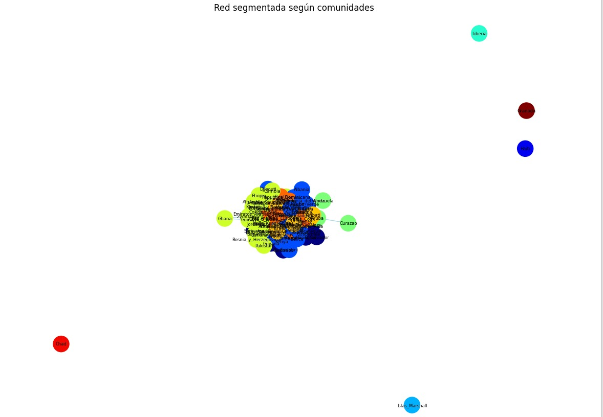

# 🧮 Tarea 3

*Integrantes:*
- Bruno Ruiz (20212386)
- Carlos Mansilla (20204125)

## Resultados
Se puede apreciar que los casos con mayor influencia dentro de la red son: La unión europea, Estados Unidos, China y la India, en ese orden de mayor a menor. Por otro lado, se encuentra que existen países con muy pocas conexiones dentro de la red tales como Curazao, Ghana, Gambia y Venezuela. Se puede deducir que, en general, los casos analizados poseen mayor closeness o centralidad que degree; lo que podría explicar la rapidez de conexión a diferenciarlo de la cantidad de conexiones. La mayoría de países poseen pocas conexiones pero tienen más rapidez para llegar entre ellos por lo que se están generando conexiones según área geográfica con ejemplos como Argentina, Bolivia y Brasil como sus principales socios (área de América Latina) y Emiratos Árabes Unidos, Argelia, Armenia, Angola (Norte de África y Asia Occidental).
Además, cabe recalcar que la Unión Europea, Estados Unidos, China y la India funcionan como aliados clave para la conexión de países que pertenen a sub áreas distintas, tales como el caso de Iraq y Singapur mediante la Unión Europea.

https://mansishaa.github.io/week3/

## Exploración

La base de datos utilizada para la creación de la red fueron las exportaciones de mercancías entre 103 países obtenidas de la página de la Organización Mundial del Comercio.

https://www.wto.org/spanish/res_s/statis_s/statis_maps_s.htm?country_selected=DEU&optionSelected=3

Red de exportaciones:

Comportamiento de los nodos:

Redes de comportamiento:

